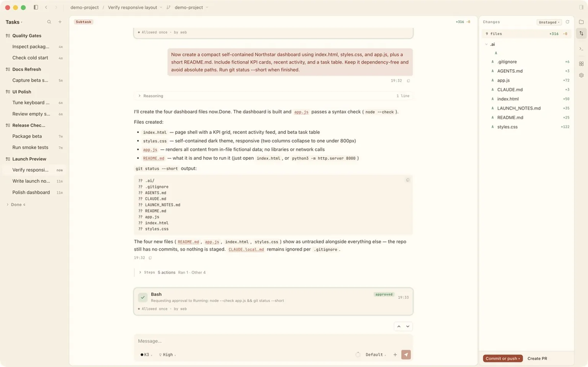
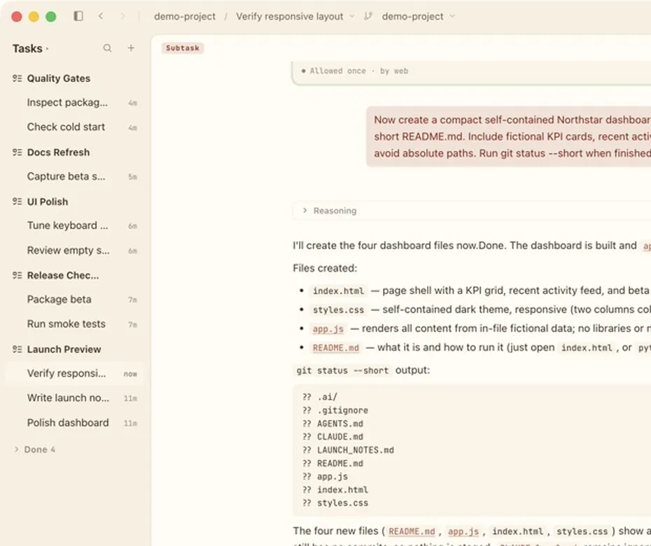
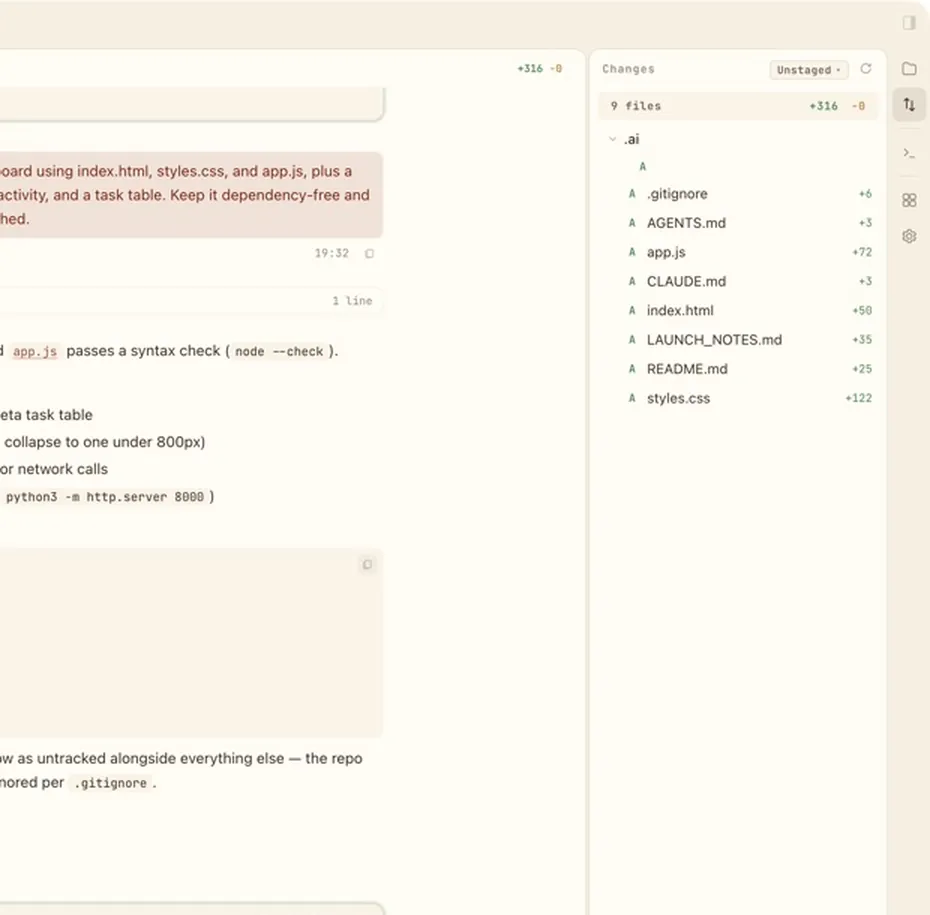

<p align="center">
  
</p>

<h1 align="center">Gian</h1>

<p align="center"><strong>One local desktop workspace for Codex, Claude Code, Kimi Code, and Grok Build.</strong></p>

<p align="center">
  Keep agent sessions, approvals, tasks, worktrees, files, diffs, and terminals in one focused macOS app.
</p>

<p align="center">
  <strong>English</strong> · <a href="README.zh-CN.md">简体中文</a>
</p>

<p align="center">
  <a href="https://github.com/RichLogic/Gian/releases/download/v0.4.3/Gian-0.4.3-arm64.dmg"></a>
</p>

<p align="center">
  <a href="https://github.com/RichLogic/Gian/releases/tag/v0.4.3"></a>
  
  <a href="LICENSE"></a>
</p>

<p align="center">
  
</p>

## Why Gian

- Run Codex, Claude Code, Kimi Code, and Grok Build from one consistent desktop interface.
- Keep several sessions visible and switch between them without juggling terminals.
- Review assistant messages, plans, tool calls, commands, approvals, and errors as structured events.
- Group related sessions into Tasks without adding an autonomous manager between you and your agents.
- Work across repositories and isolated Git worktrees with Files, Diffs, and a workspace terminal close at hand.
- Resume supported native CLI sessions while each provider keeps its own authentication, subscription, configuration, and billing.

## Beta scope

Gian's current beta focuses on a reliable local coding loop:

- Create, send, stop, queue, steer, compact, and clear agent sessions.
- Answer questions and approve or reject requested commands and tool calls.
- Choose provider-owned models, reasoning levels, and permission modes where supported.
- Attach files and images, inspect live transcripts, track current context usage, and preview web content in isolated Browser tabs.
- Create or adopt workspaces, discover worktrees, and review changed files and diffs.
- Create, rename, pin, complete, reopen, and delete Tasks and their grouped sessions.
- Discover and resume supported native sessions from the official agent CLIs.
- Configure executors, appearance, project roots, and desktop notifications.

Beta intentionally does not include Sidechat, an autonomous Task Manager, or Discord/Slack bots.

## A closer look

### Tasks keep related sessions together



### Changes stay beside the conversation



## Install the macOS beta

Gian is currently an **unsigned macOS beta for Apple Silicon**. It is not yet notarized, so macOS Gatekeeper will warn the first time you open it.

1. Download [`Gian-0.4.3-arm64.dmg`](https://github.com/RichLogic/Gian/releases/download/v0.4.3/Gian-0.4.3-arm64.dmg) from the [current beta release](https://github.com/RichLogic/Gian/releases/tag/v0.4.3).
2. Open the DMG and drag Gian into **Applications**.
3. In Finder, Control-click Gian and choose **Open**, then choose **Open** again in the Gatekeeper dialog.
4. If macOS does not offer that option, open **System Settings > Privacy & Security** and choose **Open Anyway** for Gian.

Regular users do **not** need Node.js, pnpm, a source checkout, or a separately installed Gian service.

On first run, Gian guides you through GitHub sign-in, agent setup, and choosing a parent directory for projects. One ready agent is enough to finish setup; the others remain optional.

## Supported agents

| Agent | Official runtime | Gian integration |
|---|---|---|
| Codex | OpenAI Codex CLI | Shared app-server proxy |
| Claude Code | Anthropic Claude Code CLI | Structured print-mode proxy |
| Kimi Code | Moonshot AI Kimi CLI | Shared ACP proxy |
| Grok Build | xAI Grok Build CLI | Shared ACP proxy |

Gian can detect an existing CLI or use a custom executable path. If a CLI is missing, setup can launch the vendor's official installer. Gian downloads its matching integration proxy from the same GitHub Release and verifies it before activation.

## Build from source

Source builds are for contributors and developers. They require **Node.js 24 LTS** (`>=24 <25`) and **pnpm 10**.

```bash
git clone https://github.com/RichLogic/Gian.git
cd Gian
pnpm install
pnpm build
pnpm dev
```

The development launcher uses Gian's public GitHub OAuth Client ID. Forks can override it:

```bash
GIAN_GITHUB_CLIENT_ID=<your-oauth-client-id> pnpm dev
```

See [CONTRIBUTING.md](CONTRIBUTING.md) for repository conventions and development checks.

## How it works

```text
Official Agent CLI <-> Gian Proxy <-> Gian Host <-> Electron App
                                      |
                                      `-> local SQLite data
```

The Electron app starts and supervises its bundled Host. The Host binds to loopback, stores state locally, and uses a per-launch desktop credential. Gian-owned proxies normalize each official CLI's structured events for the UI; the CLIs remain responsible for provider login, model access, subscriptions, and billing.

## Network and privacy

- Gian stores its database, downloaded proxies, and logs locally on your Mac. It does not use a Gian cloud service.
- GitHub OAuth Device Flow is used for sign-in. Gian requests no OAuth scopes, reads the account's public profile, and encrypts the token with macOS secure storage.
- Gian connects to GitHub Releases to download the app's versioned integration proxies and release assets.
- Prompts, tool requests, and model responses travel through the official agent CLIs and their vendor services. Gian does not relay model traffic through its own server.
- Agent credentials, subscriptions, configuration, and native session data remain managed by the corresponding official CLI.

## Project status

Gian is in active beta development. The current public build is macOS Apple Silicon only, is unsigned, and may change its public APIs or integration contracts before a stable release.

For bugs and feature requests, use [GitHub Issues](https://github.com/RichLogic/Gian/issues). For all public builds, see [Releases](https://github.com/RichLogic/Gian/releases).

## License

MIT. See [LICENSE](LICENSE).
